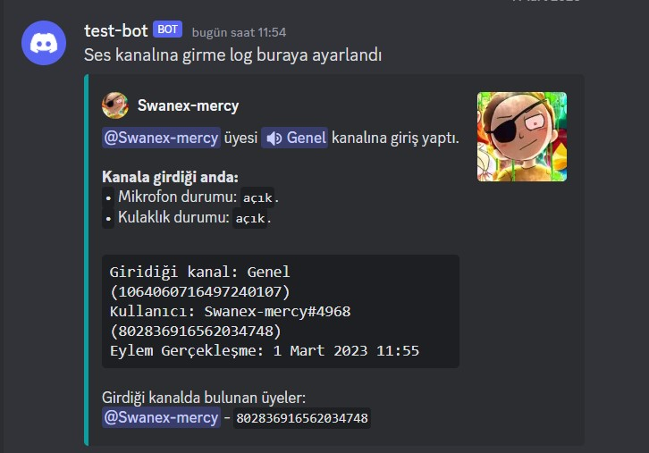

# discord-logs
discord'da log ayarlama

`config.json` isimli dosyanın içerisini doldurunuz ondan sonra 

```console
node komut.js
```
şeklinde yazıp komutları yükleyiniz sonra botu
```console
node index.js
```
şeklinde yazarak çalıştırınız.

Not: Koruma özelliği bakımdadır ve ayrıca diğer `.json` dosyalarını ellemeyiniz.

Botu çalıştırdıktan sonra `/log` yazıp oradan `ayarlar'ı` seçip ayarları bir kanala atın ondan sonra isterseniz `/log` yazıp oradan tek tek log kanallarını elle ayarlayabilirsiniz, ama derseniz ben uğraşmak istemiyorum `/kur` yazıp gönderin kendisi tam otomatik bir şekilde kuracaktır.

dipnot: node v19.2.0 sürümünde ve npm ise 9.1.1 sürümündedir.


Örnek görseller aşağıda





